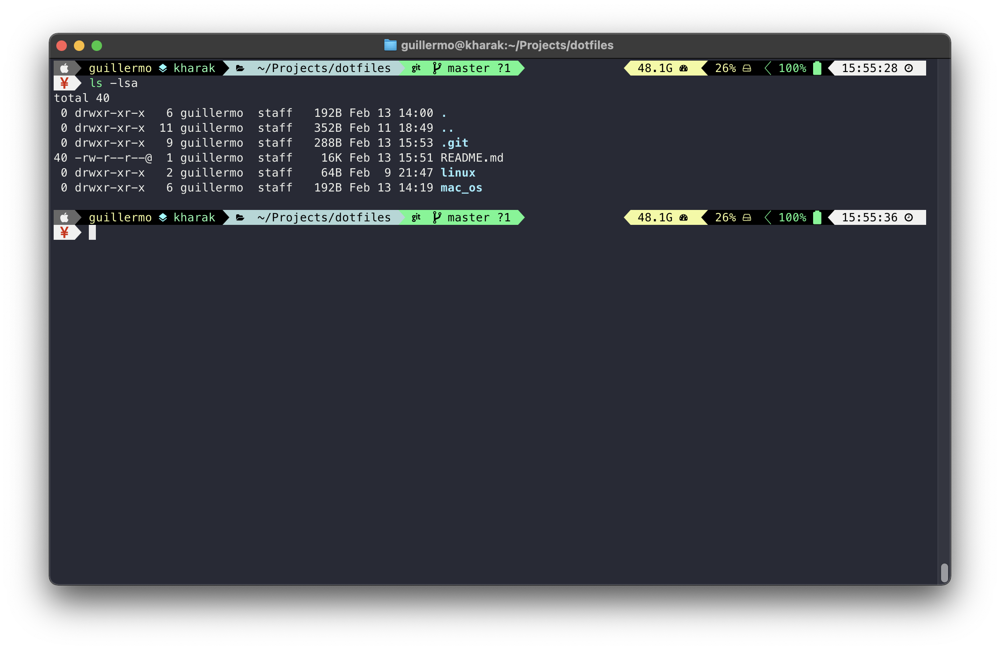

# Dotfiles

Files and configuration guides for terminal and system settings, mostly focused on macOS.

## macOS Setup Guide 2022

### System Preferences

#### Update macOS

- System Preferences -> Software Update

### Defaults

General configurations from system settings and some quality of life tweaks.

```bash
# Close any open System Preferences panes, to prevent them from overriding
# settings we’re about to change
osascript -e 'tell application "System Preferences" to quit'
# Ask for the administrator password upfront
sudo -v
# Keep-alive: update existing `sudo` time stamp until `.macos` has finished
while true; do sudo -n true; sleep 60; kill -0 "$$" || exit; done 2>/dev/null &
# ==================
#   Computer Name
# ==================
# Set computer name (as done via System Preferences → Sharing)
sudo scutil --set ComputerName "kharak"
sudo scutil --set HostName "kharak"
sudo scutil --set LocalHostName "kharak"
sudo defaults write /Library/Preferences/SystemConfiguration/com.apple.smb.server NetBIOSName -string "kharak"
# ==================
#   General
# ==================
# Set sidebar icons size to small
defaults write NSGlobalDomain "NSTableViewDefaultSizeMode" -int 1
# ==================
#   Dock
# ==================
# Dock icon size of 25 pixels
defaults write com.apple.dock "tilesize" -int 25
# Don't show recently used apps in the Dock
defaults write com.apple.dock "show-recents" -bool false
# Always display the dock
defaults write com.apple.dock "autohide" -bool false
# Don’t animate opening applications from the Dock
defaults write com.apple.dock launchanim -bool false
# Disable Bouncing dock icons
defaults write com.apple.dock no-bouncing -bool true
# ==================
#   Finder
# ==================
# Keep folders on top when sorting by name
defaults write com.apple.finder _FXSortFoldersFirst -bool true
# When performing a search, search the current folder by default
defaults write com.apple.finder FXDefaultSearchScope -string "SCcf"
# Show Library folder
chflags nohidden ~/Library
# Show the /Volumes folder
sudo chflags nohidden /Volumes
# Show hidden files
defaults write com.apple.finder AppleShowAllFiles YES
# Show path bar
defaults write com.apple.finder ShowPathbar -bool true
# Show status bar
defaults write com.apple.finder ShowStatusBar -bool true
# Show all filename extensions
defaults write -g AppleShowAllExtensions -bool true
# Display full POSIX path as Finder window title
defaults write com.apple.finder _FXShowPosixPathInTitle -bool true
# Disable the warning when changing a file extension
defaults write com.apple.finder FXEnableExtensionChangeWarning -bool false
# Disable the warning before emptying the Trash
defaults write com.apple.finder WarnOnEmptyTrash -bool false
# Finder: disable window animations and Get Info animations
defaults write com.apple.finder DisableAllAnimations -bool true
# Add option to quit Finder
defaults write com.apple.finder QuitMenuItem -bool TRUE
# Finder: disable window animations and Get Info animations
defaults write com.apple.finder DisableAllAnimations -bool true
# Avoid creating .DS_Store files on network or USB volumes
defaults write com.apple.desktopservices DSDontWriteNetworkStores -bool true
defaults write com.apple.desktopservices DSDontWriteUSBStores -bool true
# Show icons for hard drives, servers, and removable media on the desktop
defaults write com.apple.finder ShowExternalHardDrivesOnDesktop -bool true
defaults write com.apple.finder ShowHardDrivesOnDesktop -bool false
# defaults write com.apple.finder ShowMountedServersOnDesktop -bool true
defaults write com.apple.finder ShowRemovableMediaOnDesktop -bool true
# ==================
#   Chrome
# ==================
# Prevent left and right swipe through history in Chrome
defaults write com.google.Chrome AppleEnableSwipeNavigateWithScrolls -bool false
# Disable the all too sensitive backswipe on trackpads
defaults write com.google.Chrome AppleEnableSwipeNavigateWithScrolls -bool false
defaults write com.google.Chrome.canary AppleEnableSwipeNavigateWithScrolls -bool false
# Disable the all too sensitive backswipe on Magic Mouse
defaults write com.google.Chrome AppleEnableMouseSwipeNavigateWithScrolls -bool false
defaults write com.google.Chrome.canary AppleEnableMouseSwipeNavigateWithScrolls -bool false
# ==================
#   System
# ==================
# Disable Resume system-wide
defaults write com.apple.systempreferences NSQuitAlwaysKeepsWindows -bool false
# Disable Notification Center and remove the menu bar icon
launchctl unload -w /System/Library/LaunchAgents/com.apple.notificationcenterui.plist 2> /dev/null
# Enable subpixel font rendering on non-Apple LCDs
# Reference: https://github.com/kevinSuttle/macOS-Defaults/issues/17#issuecomment-266633501
defaults write NSGlobalDomain AppleFontSmoothing -int 1
# Disable automatic window animations
defaults write NSGlobalDomain NSAutomaticWindowAnimationsEnabled -bool false
# Disable the “Are you sure you want to open this application?” dialog
defaults write com.apple.LaunchServices LSQuarantine -bool false
# Expand save panel by default
defaults write NSGlobalDomain NSNavPanelExpandedStateForSaveMode -bool true
defaults write NSGlobalDomain NSNavPanelExpandedStateForSaveMode2 -bool true
# Expand print panel by default
defaults write NSGlobalDomain PMPrintingExpandedStateForPrint -bool true
defaults write NSGlobalDomain PMPrintingExpandedStateForPrint2 -bool true
# Reveal IP address, hostname, OS version, etc. when clicking the clock
# in the login window
sudo defaults write /Library/Preferences/com.apple.loginwindow AdminHostInfo HostName
# Disable Notification Center and remove the menu bar icon
launchctl unload -w /System/Library/LaunchAgents/com.apple.notificationcenterui.plist 2> /dev/null
#Disable Resume applications on reboot (system-wide)
defaults write com.apple.systempreferences NSQuitAlwaysKeepsWindows -bool false
defaults write -g NSQuitAlwaysKeepsWindows -bool false
# ==================
#   Safari
# ==================
# Privacy: don’t send search queries to Apple
defaults write com.apple.Safari UniversalSearchEnabled -bool false
defaults write com.apple.Safari SuppressSearchSuggestions -bool true
# ==================
#   Mail
# ==================
# Disable send and reply animations in Mail.app
defaults write com.apple.mail DisableReplyAnimations -bool true
defaults write com.apple.mail DisableSendAnimations -bool true
# Copy email addresses as `foo@example.com` instead of `Foo Bar <foo@example.com>` in Mail.app
defaults write com.apple.mail AddressesIncludeNameOnPasteboard -bool false
# ==================
#   iTerm2
# ==================
# Disable the annoying line marks
defaults write com.apple.Terminal ShowLineMarks -int 0
# Don’t display the annoying prompt when quitting iTerm
defaults write com.googlecode.iterm2 PromptOnQuit -bool false
# ==================
#   Photos
# ==================
# Prevent Photos from opening automatically when devices are plugged in
defaults -currentHost write com.apple.ImageCapture disableHotPlug -bool true
# ==================
#   Transmission
# ==================
# Use `~/Documents/Torrents` to store incomplete downloads
defaults write org.m0k.transmission UseIncompleteDownloadFolder -bool true
defaults write org.m0k.transmission IncompleteDownloadFolder -string "${HOME}/Documents/Torrents"
# Use `~/Downloads` to store completed downloads
defaults write org.m0k.transmission DownloadLocationConstant -bool true
# Don’t prompt for confirmation before downloading
defaults write org.m0k.transmission DownloadAsk -bool false
defaults write org.m0k.transmission MagnetOpenAsk -bool false
# Don’t prompt for confirmation before removing non-downloading active transfers
defaults write org.m0k.transmission CheckRemoveDownloading -bool true
# Trash original torrent files
defaults write org.m0k.transmission DeleteOriginalTorrent -bool true
# Hide the donate message
defaults write org.m0k.transmission WarningDonate -bool false
# Hide the legal disclaimer
defaults write org.m0k.transmission WarningLegal -bool false
# ==================
#   Printer
# ==================
# Show Expanded Print Dialog by Default
defaults write -g PMPrintingExpandedStateForPrint -bool TRUE
# ==================
#   Screenshots
# ==================
# Save screenshots in PNG format (other options: BMP, GIF, JPG, PDF, TIFF)
defaults write com.apple.screencapture type -string "png"
# ==================
#   Language
# ==================
# Set language and text formats
# Note: if you’re in the US, replace `EUR` with `USD`, `Centimeters` with
# `Inches`, `en_GB` with `en_US`, and `true` with `false`.
defaults write NSGlobalDomain AppleLanguages -array "en" "es"
defaults write NSGlobalDomain AppleLocale -string "en_US@currency=EUR"
defaults write NSGlobalDomain AppleMeasurementUnits -string "Centimeters"
defaults write NSGlobalDomain AppleMetricUnits -bool true
# ==================
#   Keyboard
# ==================
# Disable automatic capitalization as it’s annoying when typing code
defaults write NSGlobalDomain NSAutomaticCapitalizationEnabled -bool false
# Disable smart dashes as they’re annoying when typing code
defaults write NSGlobalDomain NSAutomaticDashSubstitutionEnabled -bool false
# Disable automatic period substitution as it’s annoying when typing code
defaults write NSGlobalDomain NSAutomaticPeriodSubstitutionEnabled -bool false
# Disable auto-correct
defaults write NSGlobalDomain NSAutomaticSpellingCorrectionEnabled -bool false
# ==================
#   Bluetooth
# ==================
# Increase sound quality for Bluetooth headphones/headsets
defaults write com.apple.BluetoothAudioAgent "Apple Bitpool Min (editable)" -int 40
# ==================
#   Menu Bar
# ==================
# The time separator flashes every second
defaults write com.apple.menuextra.clock "FlashDateSeparators" -bool "true" && killall SystemUIServer
# Set date format in menu bar
defaults write com.apple.menuextra.clock "DateFormat" -string "\"EEE d MMM HH:mm:ss\""
# Show battery icon in Menu Bar
defaults -currentHost write "com.apple.controlcenter" "Battery" -int 22
# Show Battery percentage in Menu Bar
defaults -currentHost write "com.apple.controlcenter" "BatteryShowPercentage" -bool "true"
# Show Bluetooth icon in Menu Bar
defaults -currentHost write "com.apple.controlcenter" "Bluetooth" -int 18
# Show Sound icon in Menu Bar
defaults -currentHost write "com.apple.controlcenter" "Sound" -int 18
# Show Screen Mirroring icon in Menu Bar
defaults -currentHost write "com.apple.controlcenter" "ScreenMirroring" -int 18
# Show WiFi icon in Menu Bar
defaults -currentHost write "com.apple.controlcenter" "WiFi" -int 2
# Display is always available in Control Center
defaults -currentHost write "com.apple.controlcenter" "Display" -int 18
# Don't show Keyboard Brightness icon in Menu Bar
defaults -currentHost write "com.apple.controlcenter" "KeyboardBrightness" -int 8
# Don't show AirDrop icon in Menu Bar
defaults -currentHost write "com.apple.controlcenter" "AirDrop" -int 8
# Don't show Siri icon in Menu Bar
defaults write "com.apple.Siri" "StatusMenuVisible" -bool "false"
# Don't show Spotlight icon in Menu Bar
defaults -currentHost write "com.apple.Spotlight" "MenuItemHidden" -bool "true"
# ==================
#   Trackpad/Mouse
# ==================
# Trackpad: enable tap to click for this user and for the login screen
defaults write com.apple.driver.AppleBluetoothMultitouch.trackpad Clicking -bool true
defaults -currentHost write NSGlobalDomain com.apple.mouse.tapBehavior -int 1
defaults write NSGlobalDomain com.apple.mouse.tapBehavior -int 1
# Trackpad: map bottom right corner to right-click
defaults write com.apple.driver.AppleBluetoothMultitouch.trackpad TrackpadCornerSecondaryClick -int 2
defaults write com.apple.driver.AppleBluetoothMultitouch.trackpad TrackpadRightClick -bool true
defaults -currentHost write NSGlobalDomain com.apple.trackpad.trackpadCornerClickBehavior -int 1
defaults -currentHost write NSGlobalDomain com.apple.trackpad.enableSecondaryClick -bool true
# Enable Trackpad pinch to zoom
defaults write "com.apple.driver.AppleBluetoothMultitouch.trackpad" "TrackpadPinch" -bool "true"
defaults write "com.apple.AppleMultitouchTrackpad" "TrackpadPinch" -bool "true"
# Disable “natural” (Lion-style) scrolling
defaults write NSGlobalDomain com.apple.swipescrolldirection -bool false
# ==================
#   App Store
# ==================
# Enable the WebKit Developer Tools in the Mac App Store
defaults write com.apple.appstore WebKitDeveloperExtras -bool true
# Enable the automatic update check
defaults write com.apple.SoftwareUpdate AutomaticCheckEnabled -bool true
# Turn on app auto-update
defaults write com.apple.commerce AutoUpdate -bool true
```

### iTerm2



#### 1. [Install hyper-snazzy theme](https://github.com/sindresorhus/hyper-snazzy)

#### 2. [Install Inconsolata Nerd Font](https://github.com/ryanoasis/nerd-fonts/releases/download/v2.1.0/Inconsolata.zip)/[MesloLGS NF Font](https://github.com/ryanoasis/nerd-fonts/releases/download/v2.1.0/Meslo.zip)

#### 3. Restore profile from `iterm2/Guillermo.json`

### Homebrew

Install [Homebrew](https://brew.sh/)

```bash
/bin/bash -c "$(curl -fsSL https://raw.githubusercontent.com/Homebrew/install/HEAD/install.sh)"
```

### Homebrew Applications

```bash
brew install git make rectangle vlc tree htop wget youtube-dl nmap fnm diff-so-fancy go maven gradle openjdk bazel qemu tldr jq imagemagick zsh ruby ffmpeg gcc
brew install --cask iterm2
brew install --cask spotify
brew install --cask transmission
brew install --cask visual-studio-code
brew install --cask mpv 
brew install --cask postman
brew install --cask dbeaver-community
brew install --cask stats
```

Add `GOPATH/bin` directory to your PATH environment variable so you can run Go programs anywhere.

```bash
export PATH=$PATH:$(go env GOPATH)/bin
```

### Python

```bash
brew install python
pip3 install --upgrade pip 
pip install speedtest-cli
```

### Pyenv

```bash
brew update
brew install pyenv
pyenv install --list | grep " 3\.[89]" #Install latest
pyenv install -v 3.9.X
pyenv global 3.9.X
```

### Oh My ZSH + Plugins

#### 1. Install ZSH

```bash
# Remove last login message from terminal
touch .hushlogin
# Install Oh My Zsh from Github https://github.com/ohmyzsh/ohmyzsh
sh -c "$(curl -fsSL https://raw.githubusercontent.com/ohmyzsh/ohmyzsh/master/tools/install.sh)"
```

#### 2. Configure the zsh shell for M1 macs

```bash
which zsh 
/opt/homebrew/bin/zsh
# Edit /etc/shells and append the zsh homebrew shell
chsh -s $(which zsh)
```

#### 3. Plugins

##### 3.1. Autosuggessions

```bash
git clone https://github.com/zsh-users/zsh-autosuggestions ${ZSH_CUSTOM:-~/.oh-my-zsh/custom}/plugins/zsh-autosuggestions
```

```bash
plugins=(
    # Other plugins... 
    zsh-autosuggestions
    )
```

##### 3.2. Syntax Highlighting

```bash
git clone https://github.com/zsh-users/zsh-syntax-highlighting.git ${ZSH_CUSTOM:-~/.oh-my-zsh/custom}/plugins/zsh-syntax-highlighting
```

```bash
plugins=( 
    # Other plugins...
    zsh-syntax-highlighting
    )
```

##### 3.3. Completions

```bash
git clone https://github.com/zsh-users/zsh-completions ${ZSH_CUSTOM:=~/.oh-my-zsh/custom}/plugins/zsh-completions
```

```bash
plugins=( 
    # Other plugins...
        zsh-completions
    )
```

#### 4. Install Powerlevel10k

Clone the repository:

```bash
git clone --depth=1 https://github.com/romkatv/powerlevel10k.git ${ZSH_CUSTOM:-$HOME/.oh-my-zsh/custom}/themes/powerlevel10k
```

#### 5. Configure `.zshrc` and `.p10.zsh`

### Git

Install and configure Git

```bash
brew install git
git config --global user.name "Your Name Here"
git config --global user.email "your_email@youremail.com"
ssh-add --apple-use-keychain ~/.ssh/id_rsa
git config --global core.excludesfile ~/.gitignore
git config --global core.pager "diff-so-fancy | less --tabs=4 -RFX"
```

Create and configure global `.gitignore`

```bash
touch ~/.gitignore
```

Configure git for múltiple ssh keys

```bash
touch ~/.ssh/config
```

Add hosts to the `~/.ssh/config` file

```bash
# Main account
Host github.com
   HostName github.com
   IdentityFile ~/.ssh/id_rsa
   IdentitiesOnly yes

# Other github account: userName
Host github-userName
   HostName github.com
   IdentityFile ~/.ssh/id_rsa_userName
   IdentitiesOnly yes
```

### Screenshots Folder

```bash
mkdir /Users/$USER/Screenshots
defaults write com.apple.screencapture location /Users/userName/Screenshots && killall SystemUIServer
```

### Node Manager

```bash
eval "$(fnm env)"
fnm list-remote
fnm install vx.x.x
fnm ls
fnm use vx.x.x
fnm current
```

### Nano

Add colors to nano

```bash
cp mac_os/nano/.nanorc ~/.nanorc
```

### macOS Apps

- Anaconda
- Amphetamine
- Cyberduck
- DBeaver
- Discord
- Docker Desktop
- Etcher
- Firefox
- Github Desktop
- Google Chrome
- iTerm2
- Jetbrains Toolbox
- Kap
- Katalon Studio
- KiCad
- Teams
- Office
- mpv
- Nextcloud
- OBS
- Omnigraffle
- pgAdmin
- Pixelmator Pro
- R Studio
- Rectangle
- Postman
- Spotify
- The Unarchiver
- TeX
- Timer
- Transmission
- Tunnelblick
- VIA
- Visual Studio Code
- VLC
- WhatsApp
- Xcode
- Zoom
