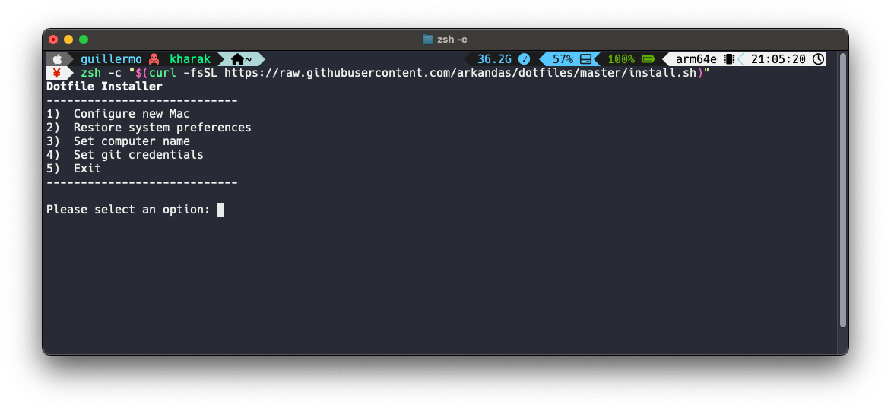
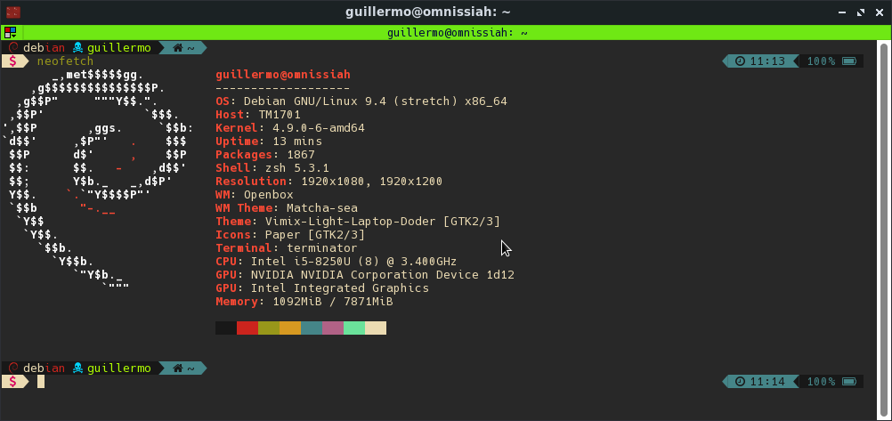
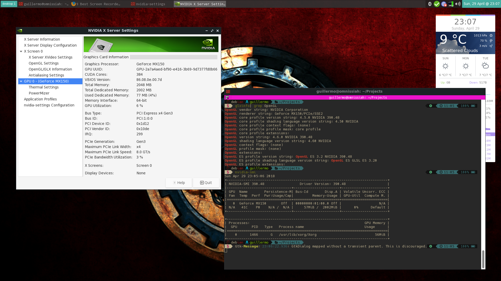
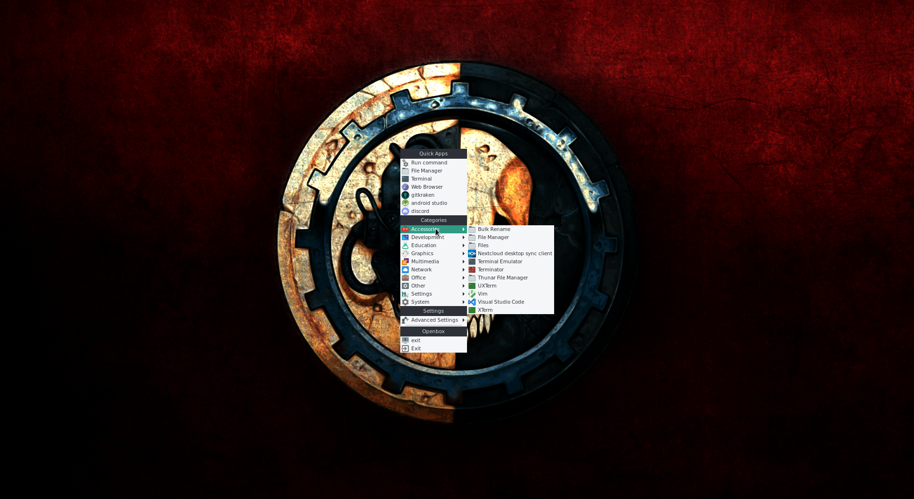
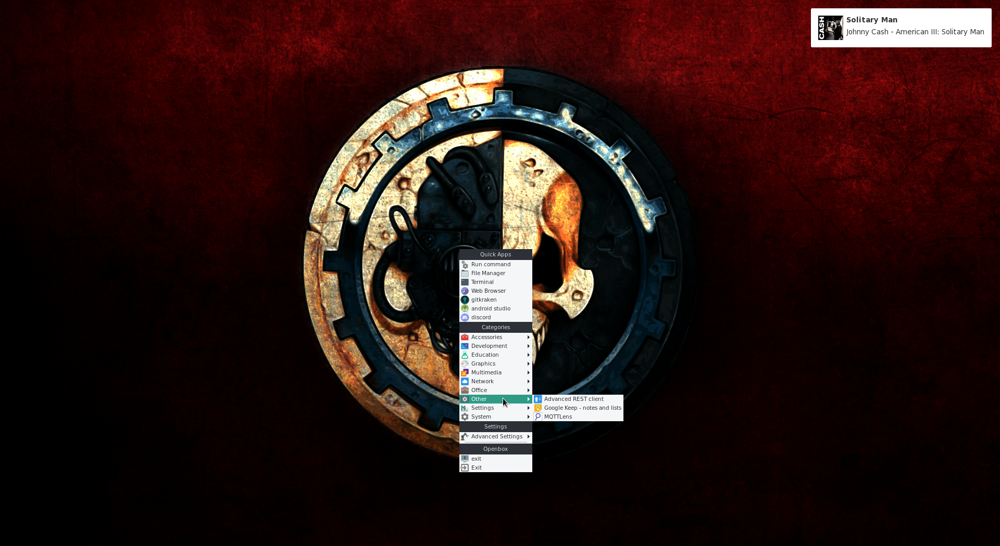
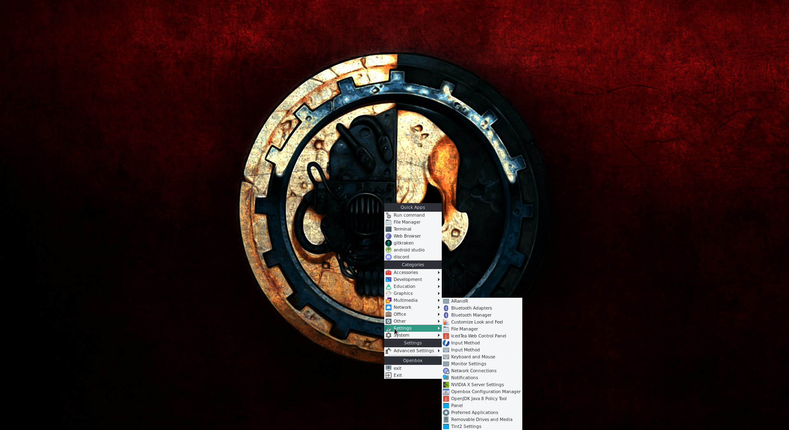

Files and configuration scripts for terminal and system preferences, mostly focused on macOS.

## macOS configuration


### Quick Installation Script

```bash
zsh -c "$(curl -fsSL https://raw.githubusercontent.com/arkandas/dotfiles/master/install.sh)"
```



:warning: **NOTE:** This installer executes scripts from the `utils` folder, you should check them first to verify what you're installing.

The following options are currently available:

1. **Configure new Mac:**
   - Installs XCode Command Line Tools and clones this repository
   - Installs [Homebrew](https://brew.sh/), formulae, casks and apps from [Brewfile](./mac_os/brew/Brewfile)
   - Installs [Oh-my-zsh](https://ohmyz.sh/) and plugins:
     - [zsh-autosuggestions](https://github.com/zsh-users/zsh-autosuggestions)
     - [zsh-syntax-highlighting](https://github.com/zsh-users/zsh-syntax-highlighting)
     - [zsh-completions](https://github.com/zsh-users/zsh-completions)
   - Installs [Powerlevel10k Zsh theme](https://github.com/romkatv/powerlevel10k)
   - Copies [Iterm2](./mac_os/iterm2/com.googlecode.iterm2.plist), [.zshrc](./mac_os/zsh/.zshrc), [Powerlevel10k](mac_os/zsh/.p10k.zsh), [nano](./mac_os/nano/.nanorc) and [.gitignore](./mac_os/git/.gitignore) settings
   - Configures and installs OpenJDK, pyenv, fnm and Angular
2. **Restore system preferences**
   - Sets System Preferences from [os_prefs.sh](./mac_os/os_settings/os_prefs.sh)
3. **Set computer name:**
    - Prompts the user for a new computer name (as done via System Preferences → Sharing)
4. **Set git credentials:**
    - Prompts the user for their git username and email
    - Adds `~/.ssh/id_rsa` to the users's keychain
    - Configures git to globally ignore certain files defined in `~/.gitignore`
    - Configures git to use diff-so-fancy for all diff output
    - **Optional:** Set multiple git accounts in the `~/.ssh/config` file:

      ```bash
      # Main account
      Host github.com
      HostName github.com
      AddKeysToAgent yes
      UseKeychain yes
      IdentityFile ~/.ssh/id_rsa

      # Other github account: userName
      Host github-userName
      HostName github.com
      AddKeysToAgent yes
      UseKeychain yes
      IdentityFile ~/.ssh/id_rsa_userName
      IdentitiesOnly yes
      ```

## Linux Configuration

### Debian Openbox





### Nvidia Drivers

- Nvidia Optimus drivers: <https://wiki.debian.org/NvidiaGraphicsDrivers/Optimus>
- Install xorg and xorg-server
- Add [Jessie Backports](https://backports.debian.org/Instructions/)
- [Remove nouveau](http://http://www.allaboutlinux.eu/remove-nouveau-and-install-nvidia-driver-in-debian-8/)
- Blacklist nouveau on modprobe.d with intel microcode
- Install nvidia-drivers backports and linux headers 

### Debian non-free microcode

- **Intel video drivers**

``` bash
sudo apt-get install xserver-xorg-video-intel
```

- **Intel microcode**

``` bash
sudo apt-get install intel-microcode
```

- **Wifi** (wireless tools should be installed by default)

``` bash
sudo apt-get install wireless-tools
```

### Obmenu

[Obmenu-generator github](https://github.com/trizen/obmenu-generator)

The program requires a lot of perl dependencies that can be compiled directly from their respective github repos.

Make sure dependencies are met, specially the ones related to gtk2; in case there are errors, launch the program with: `obmenu-generator -i` and check the output for pipe errors.

**IMPORTANT:** You will need a `config.pl` and a `schema.pl` file inside the `~/.config/obmenu-generator/` folder, changes to the obmenu configuration need to be made to the `schema.pl` file.

To generate a new dinamic menu with icons:

``` bash
obmenu-generator -p -i
```

To generate a static menu with icons:

``` bash
obmenu-generator -s -i
```

### Openbox

Install the following Openbox add-ons:

1. **Tint2**

``` bash
sudo apt-get install tint2
```

2. **Conky** (Requires the conky-all package)

```bash
sudo apt-get install conky-all
```

3. **Thunar daemon** for debian

4. **Volti** or **VolumeIcon** for the volume applet (The real volume controller to select output will be the gtk front of pulseaudio)
   
``` bash
sudo apt-get install volti
```

or

``` bash
sudo apt-get install volumeicon
```

5. **Network configuration**
      5.1. **With network manager:** Install the network manager package and compile or install the gnome applet (nm-applet). Requires setting the network manager on systemctl (systemctl enable NetworkManager.service)
      Edit `NetworkManager`

      5.2. **With the Wicd Applet:** Debian has control of the network interfaces out of the box (It might require to install the intel wifi microcode upgrade for the wifi subsystem)

      ``` bash
      sudo apt-get install wicd wicd-gtk
      ```

6. **blueberry-tray** with all the bluetooth config

7. **Openbox configuration utilities:**
    1. obconf
    2. lxapperance
    3. arandr
    4. lxrandr
    5. lxinput

### Rofi

1. Clone the Rofi repo [Rofi](https://github.com/DaveDavenport/rofi)

``` bash
git clone https://github.com/DaveDavenport/rofi.git
```

2. Follow the [installation guide](https://github.com/DaveDavenport/rofi/blob/next/INSTALL.md)

3. Install [Rofi themes](https://github.com/DaveDavenport/rofi-themes)

4. Add Rofi to the hotkeys section in the openbox `rc.xml` file

5. Set Rofi on obmenu-generator

6. Change rofi themes with `rofi-theme-selector`

### Keyboard Hotkeys

Hotkeys that trigger actions such as the execution of a program can be added or modified on the rc.xml file at `~/.config/openbox/rc.xml`

To add a new keybind, modify your rc.xml, and inside the \<keyboard> tag add something like:

``` xml
<!-- Custom bind -->
 <keybind key="Key combo Ex: C-A-t">
      <action name="Execute">
        <command>terminator</command>
      </action>
    </keybind>
```

The key mapping is:

| Value  |     Key     |
|--------|-------------|
|   S    | Shift Key   |
|   C    | Control Key |
|   A    | Alt Key     |
|   W    | Super Key   |
|   M    | Meta Key    |
|   H    | Hyper Key   |

Some samples:

``` xml
   <!-- Personal Keybinds-->
    <keybind key="C-A-t">
      <action name="Execute">
        <command>terminator</command>
      </action>
    </keybind>
    <keybind key="C-A-g">
      <action name="Execute">
        <command>google-chrome</command>
      </action>
    </keybind>
    <keybind key="C-A-f">
      <action name="Execute">
        <command>xdg-open http://</command>
      </action>
    </keybind>
    <keybind key="C-A-m">
      <action name="Execute">
        <command>thunar</command>
      </action>
    </keybind>
    <keybind key="C-A-c">
      <action name="Execute">
        <command>code</command>
      </action>
    </keybind>
    <keybind key="C-A-r">
      <action name="Execute">
        <command>rofi -show drun -font "inconsolata 10"</command>
      </action>
    </keybind>
    <keybind key="C-A-s">
      <action name="Execute">
        <command>shutter</command>
      </action>
    </keybind>
    <keybind key="XF86MonBrightnessUp">
      <action name="Execute">
        <command>xbacklight +10</command>
      </action>
    </keybind>
    <keybind key="XF86MonBrightnessDown">
      <action name="Execute">
        <command>xbacklight -10</command>
      </action>
    </keybind>
    <!-- End Personal Keybinds-->
```

Add volumen keys to your config

``` xml
<keybind key="XF86AudioRaiseVolume">
  <action name="Execute">
    <command>amixer set Master 5%+ unmute</command>
  </action>
</keybind>
<keybind key="XF86AudioLowerVolume">
  <action name="Execute">
    <command>amixer set Master 5%- unmute</command>
  </action>
</keybind>
<keybind key="XF86AudioMute">
  <action name="Execute">
    <command>amixer set Master toggle</command>
  </action>
</keybind>
```

### Nerd Fonts

1. Clone the Nerd Fonts project from [Nerd Fonts](https://github.com/ryanoasis/nerd-fonts)
2. Install the fonts using the provided script
3. Reload font cache with:

   ``` bash
   sudo dpkg-reconfigure fontconfig 
   ```

4. Reboot or reload with dpkg
5. Select the new system font with `lxappearance`

### Xinitrc Configuration File with nvidia drivers loaded

``` bash

#!/bin/sh

xrandr --setprovideroutputsource modesetting NVIDIA-0
xrandr --auto
# Xrandr set defaul resulution (1920x1080 - 96 dpi)
# xrandr --dpi 96

# /etc/X11/xinit/xinitrc
#
# global xinitrc file, used by all X sessions started by xinit (startx)

# invoke global X session script
./etc/X11/Xsession

exec openbox-session
```

### Keyboard

1. Change Keyboard layout from "us" to "intl"

```bash
/etc/default/keyboard
```

2. Check all available keyboard distributions on:

``` bash
/usr/share/X11/xkb/rules/xorg.lst 
```

3. Reconfigure the keyboard:

```bash
sudo dpkg-reconfigure keyboard-configuration
```

4. Update initram:

```bash
sudo update-initramfs -u 
```

### Notifications

By default, openbox does not support notifications out of the box, so we'll install a notification daemon. The most complete and less intensive resource-wise is `xfce4-notifyd`:

``` bash
sudo apt-get install xfce4-notifyd
```

### Conky

1. Install conky with:

```bash
sudo apt-get install conky-all
```

2. Clone conky proyect "conky Harmattan" from [Conky Harmattan](https://github.com/zagortenay333/Harmattan)

3. Install inkscape (Necessary for the svg icons)

4. copy the .harmattan-assets folder to the root of your home directory `~`.

5. Install dependencies `conky`, `curl` and `jq` and Droid Sans font

6. Copy your `.conkyrc` file to the root of your home directory `~`

7. Add `conky &` to your openbox autostart file

### Screenshots






